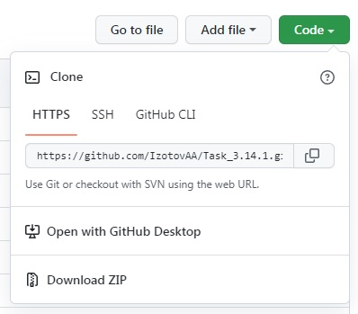

[< к содержанию](./readme.md)

## git clone

**git clone** - команда создаёт копию репозитория, копировать можно удалённый и локальный репозиторий.

---

Для того что бы копировать удалённый репозиторий себе на компьютер введите в терминал команду:

```
git clone ссылка на удалённый репозиторий
```

Ссылка на удалённый репозиторий может быть через протокол https, SSH или GitHub CLI.



---

Для того что копировать локальный репозиторий в другую папку введите в консоль команду:

```
git clone путь к папке
```

---
